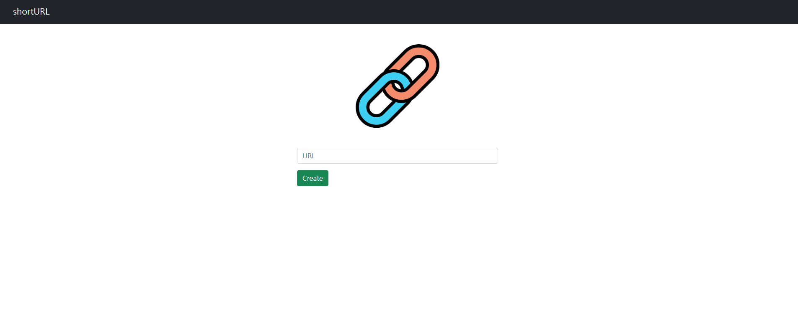

# 短網址生產器

## 介紹

短網址生產器，放入網址後會生成短網址

## 功能

- 複製網址功能
- 生成短網址

## 使用說明

1. 終端機安裝 Node.js & npm
2. clone本專案
3. 於終端機輸入: npm install , 安裝package.json
4. 輸入npm run start
5. 看見 Running shortURL on http://localhost:3000 即可輸入 localhost:3000 進入網頁
6. 退出 CTRL + C

## 使用工具
- Node.js 16.14.0
- Express 4.17.3
- Express-Handlebars 4.0.2
- bootstrap 5.1.3
- MongoDB
- mongoose 6.2.6
